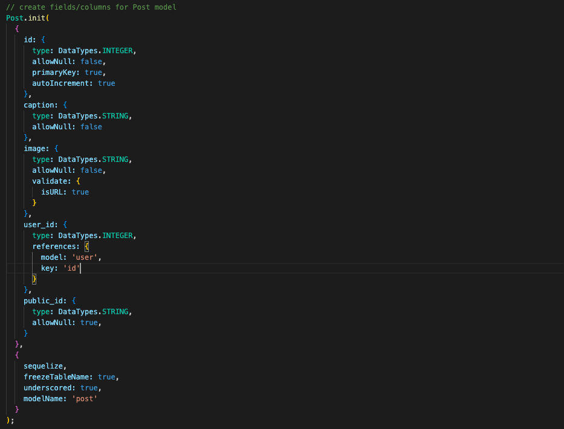
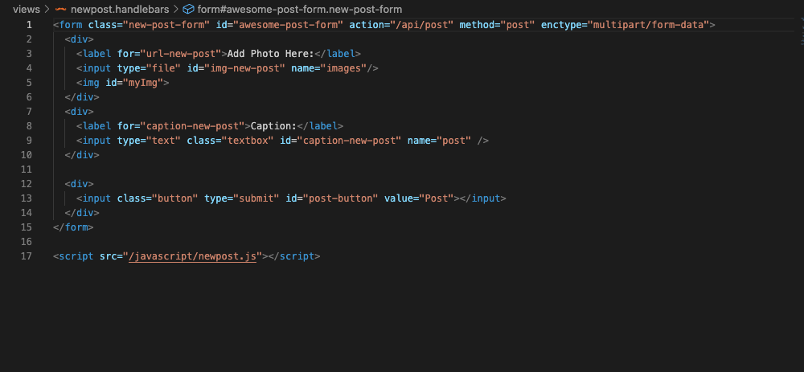
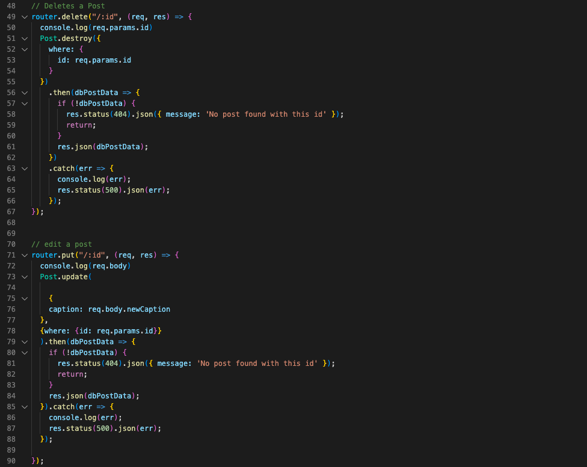
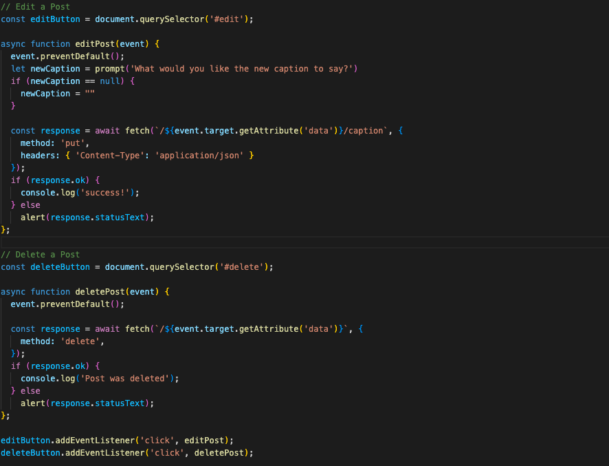

# Petsagram

## Description:

As a pet owner I want to display my pets to the world and be able to show all my pictures of them. Here comes PETSAGRAM with the ability to show them there's also the need to be able to comment and like them.

As a user, I want to be able to sign up and log in to create posts of my pets. I can also edit captions and delete post.

Deployed Link:


## Table of Contents
* [Installation](#installation)
* [Usage](#usage)
* [Gif Demo](#gif-demo)
* [Code Snippets](#code-snippets)
* [Credits](#credits)
* [Contributors](#contributors)
* [License](#license)

## Installation
The following will be the procedure for installing the application and getting the server run
- Start by cloning the repository (SSH)
```
git clone git@github.com:leeshekchun/Petsagram.git
```
- Next perform a npm install in the terminal
```
npm i
```
- Then, create a dotenv file input the following in to an .env file
```
DB_NAME='petsfeed_db'
DB_USER='your_user'
DB_PASSWORD='your_password'
CLOUDINARY_NAME = 'cloudinary_name'
API_KEY = 'api_key'
API_SECRET = 'api_secret'
```
- Now, seed the database using mysql2
```
mysql -u root -p
mysql password
SOURCE db/schema.sql
```
- Once that is all completed, in the terminal start the server
```
node server.js 
```

## Usage

The following application allows the user to:
- Create user's own account
- Create new post and add caption to the image
- Edit caption 
- Delete post


## Gif Demo


https://drive.google.com/file/d/1nZL3ewKJMBIiY_eOmbT-EsMb2Lrb44am/view

## Code Snippets

Example of the Post model:


Example of the newPost handlebar:


Example of the edit and delete routes:


Example of the edit and delete button event listener


## Credits

| Technologies used|Front-end|Back-end|
| -|-:| -:|
||||
|Cloudinary|||
||||
||||
||||
|||Handlebars|
|||Dotenv|

| Third Party Libraries|
| ------------- |
| [Boostrap](https://getbootstrap.com/) | 
| [Cloudinary](https://cloudinary.com/)

## Contributors
* Alex Canez [LinkedIn]() | [GitHub]()
* Shek Chun Lee [LinkedIn](https://www.linkedin.com/in/shekchunlee/) | [GitHub](https://github.com/leeshekchun)
* Tess Shearer [LinkedIn]() | [GitHub]()

## License
[](https://opensource.org/licenses/MIT)

Copyright (c) 2022 Alex Canez, Shek Chun Lee, Tess Shearer

Permission is hereby granted, free of charge, to any person obtaining a copy
of this software and associated documentation files (the "Software"), to deal
in the Software without restriction, including without limitation the rights
to use, copy, modify, merge, publish, distribute, sublicense, and/or sell
copies of the Software, and to permit persons to whom the Software is
furnished to do so, subject to the following conditions:

The above copyright notice and this permission notice shall be included in all
copies or substantial portions of the Software.

THE SOFTWARE IS PROVIDED "AS IS", WITHOUT WARRANTY OF ANY KIND, EXPRESS OR
IMPLIED, INCLUDING BUT NOT LIMITED TO THE WARRANTIES OF MERCHANTABILITY,
FITNESS FOR A PARTICULAR PURPOSE AND NONINFRINGEMENT. IN NO EVENT SHALL THE
AUTHORS OR COPYRIGHT HOLDERS BE LIABLE FOR ANY CLAIM, DAMAGES OR OTHER
LIABILITY, WHETHER IN AN ACTION OF CONTRACT, TORT OR OTHERWISE, ARISING FROM,
OUT OF OR IN CONNECTION WITH THE SOFTWARE OR THE USE OR OTHER DEALINGS IN THE
SOFTWARE.